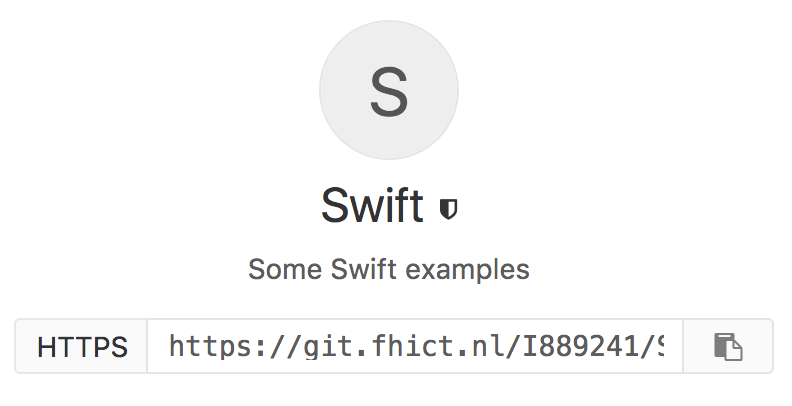
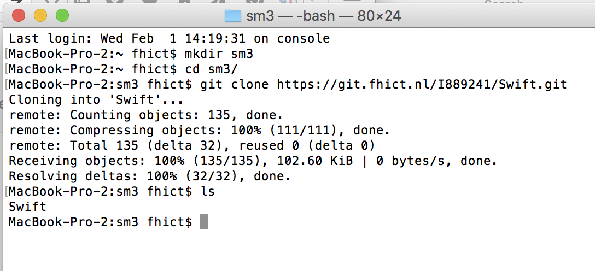

# Getting started with Git 

## Why? 

One of the most important tools in every Software Engineers' toolbox is version control! Nowadays we use ***git*** as a default for that. In git one can create a so-called `repository` which is a store for files and directories, and which gives you control over different versions of your files, and also makes it easier to work together on a project. 


FHICT has its own git-server for students which you can find via StudentSquare or directly: 
[git.fhict.nl](https://git.fhict.nl). A popular server where you can share your projects to the whole world is 
[github.com](https://github.com).  


## git basic concepts

First a little explanation of some concepts we will use later on: 

Suppose there is a `repository` on a `git server` containing a project you are going to work on. To start working on it you first `clone` the project: this means `git` will create a local copy of the repository, including the history of all files in the project. The last version of the files will be appointed as `working dir`. You can edit your files locally in this working dir the way you normally do: can be done with any editor, or using an IDE (Integrated Development Environment). 

When you made some changes to your local working dir you may want to `commit` those changes to the local history. After that you can `push` these new versions to the git server. When changes are pushed to the server other developers can `pull` your changes to their local versions. 

Next time you don't need to create a new clone, but before creating new changes yourself it is wise to `pull` possible changes made by other people (and pushed by them to the server) from the git server to your local repository and point your working working dir to this version. After that you can (again) develop until you have changes that commit and push to the server again. 

Sometimes you create a local change, commmit it locally, and when pushing it turns out that someone else pushed a change to the server: if it is in the same file we can have a `merge conflict`: before you will be able to push your change to the server you first have to `merge` the changes created by the other person into your working version. After that you can push your changes to the server. 


When using a language which has `source files` (like '.cs'-files) and `compiled files` (like '.exe'-files) then normally you will only want to add the source files to your git repository. By  creating a so-called '.gitignore'-file git will know which files to ignore, so these will not be added to the repository. Examples can be found at 
[gitignore-examples](https://www.golinuxcloud.com/gitignore-examples/). 


## Git command line

When you have git installed you will have a git command line tool. We will explain how to perform the basic actions from this CLI. After that you could look into using some GUI-Git-tool (for example Git Kraken, Git Desktop, Git GUI, Git Extensions, Git Tortoise, SmartGit). Also a lot of IDE's have Git built-in. 


### Create a repository


A repository is a place (typically online) where your code and
all previous versions of it are stored. We will now create a repository at
the so-called *git-lab* environment at FHICT
(only available for FHICT-students;
An alternative would be creating a repository at *GitHub.com*,
which is very similar)
Use a browser to go to
[https://git.fhict.nl](https://git.fhict.nl)
and create a git repository.
Copy the https-url to your clipboard, we need it in a few moments.



In Git you typically have a `repository` on a network somewhere where
all files of your project are stored, including the history of
`commits` to those files.
Furthermore you have a  `local repository` with all source code versions
which you regularly `synchronize` (using `push` and `pull`) with
the remote repository on a server.
Other people in your team sync with the same remote repository.

### Clone the repository

Next step is creating a so-called `clone` locally on your laptop.
This will be your workspace where you can develop.
By keeping it up to date with the server
(`pushing` your changes to the server
and `pulling` the changes of other developers from the server)
you can work together with other developers.

You can choose between several *tools* to do the `pulling`
and `pushing`,
some created to be easy to use and some more advanced.
Here the *command line* is used: the advantages being that **all**
`git`-functionality is available from the command line.
The syntax shown here is that of a Unix-command line (terminal or bash),
which is the same for every Unix, Linux or Mac user.
If you use have MS-Windows you could install *cygwin*
or adjust the commands a little.

Start a *terminal* or *bash* shell.
Go to the `directory` (*folder*) where you want you workspace to be.
How?
Suppose you want to create a directory (`mkdir` means *make dir*)
*myProject* in your *Documents* `directory`
you type the commands:

```
cd Documents
mkdir myProject
cd myProject
```

`cd` is short for *Change Dir*.
Most of the time you don't have to type whole names like *Documents*:
just type *Doc* and
press the *tab* key and probably the *shell* will complete the name.

In the `terminal` *clone* the git-repository from the server
to your local directory by typing:

```
git clone <pasteYourGitUrlHere>
```
After that (you will be asked for your *username*/*password*)
you now have a local copy (*clone*) of the entire history of this repository
(for a just created project this is still empty of course).
To go inside the local *repository-directory*,
which after a *clone* contains the *latest* version of the files,
use
```
cd <dirname>
```
Typing `git status` tells you that (at this moment)
there’s nothing to commit (which means you don't have made local changes
to the repository).

These are only the basics of *git*.
Most students use it to `commit` and `push` their
changes right from their `IDE`. Most *IDEs* and *editors* nowadays
have built-in `git`-functionality.


## Optional: some resources

+ [githowto.com](https://githowto.com/)
+ [gitlab university user_training](https://docs.gitlab.com/ee/university/training/user_training.html)
+ [Git book (very thorough!)](https://git-scm.com/book/en/v2)
+ [FHICT-git-server https://git.fhict.nl/](https://git.fhict.nl/)

